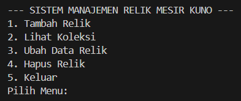
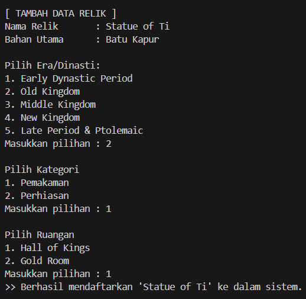
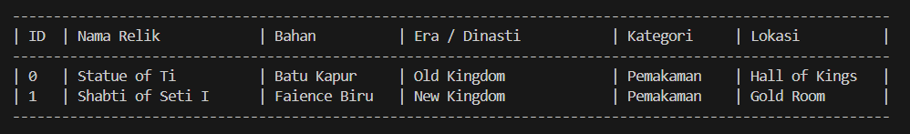
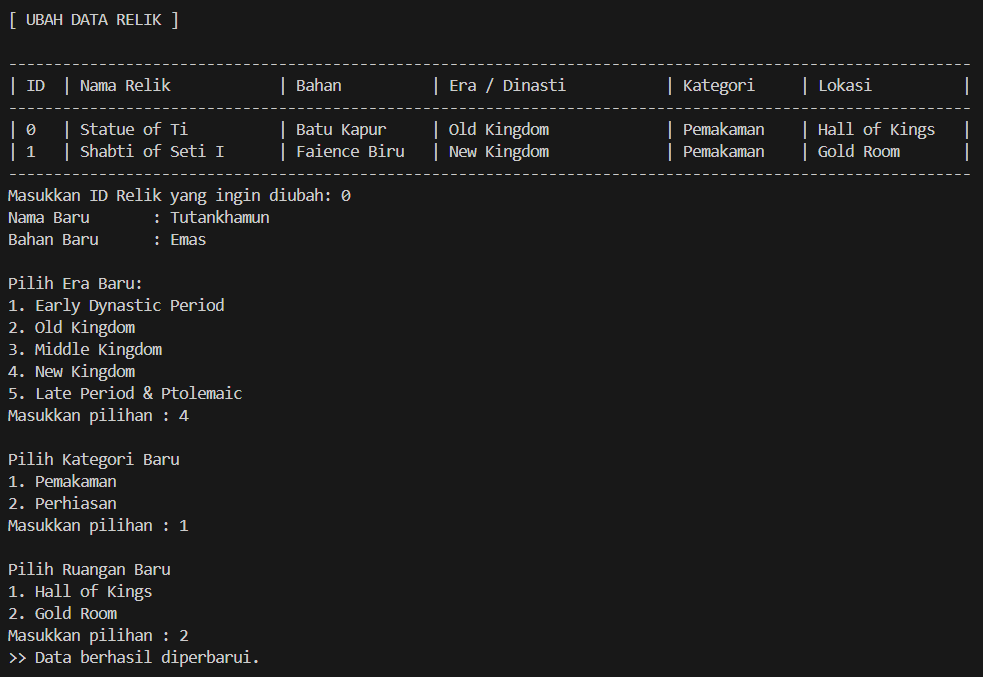
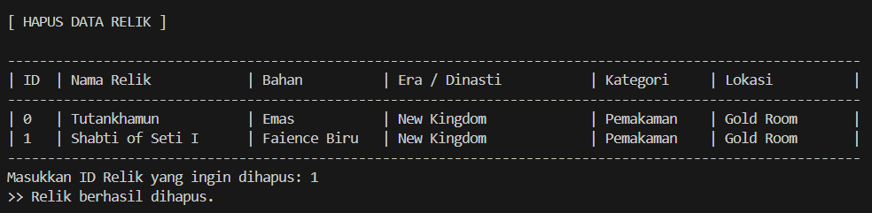

# Museum Inventory Management System
> **Digital Archive for The Egyptian Museum**


## Deskripsi Proyek
Program ini dirancang untuk mengelola data artefak sejarah di **The Egyptian Museum**. Sistem memungkinkan kurator museum untuk menambah, melihat, memperbarui, dan menghapus data relik dengan klasifikasi yang terorganisir berdasarkan Era, Kategori, dan Ruangan.

---

## Struktur OOP (Object-Oriented Programming)
Aplikasi ini dibangun dengan arsitektur modular menggunakan tiga kelas utama:

| Kelas | Deskripsi | Atribut Utama |
| :--- | :--- | :--- |
| **Relic** | Kelas inti artefak | Nama, Bahan, Era |
| **Category** | Pengelompokan jenis | Pemakaman, Perhiasan |
| **Room** | Lokasi fisik | Hall of Kings, Gold Room |

---

## Fitur Utama (CRUD)

### 1. Create (Tambah Data)
Menambahkan objek relik baru ke dalam sistem.
- **Method:** `ArrayList.add()`
- **Input:** Nama Artefak, Material, Era.

### 2. Read (Lihat Koleksi)
Menampilkan seluruh data dalam format tabel yang rapi.

### 3. Update (Ubah Data)
Memperbarui informasi artefak yang sudah ada berdasarkan indeks ID.

### 4. Delete (Hapus Data)
Menghapus data dari memori aplikasi secara permanen menggunakan `ArrayList.remove()`.

---

## Dokumentasi Output
| Menu Utama | Tambah Data |
|---|---|
|  |  |

| Lihat Koleksi | Update |
|---|---|
|  |  |

| Hapus |
|---|
|  |

---

## Cara Menjalankan
1. Clone repository ini.
2. Pastikan Java JDK sudah terinstall.
3. Compile file utama:
   ```bash

   javac Main.java

