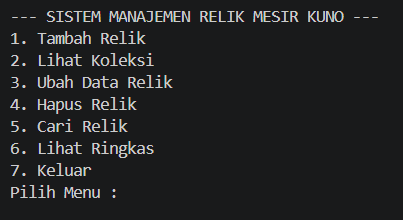
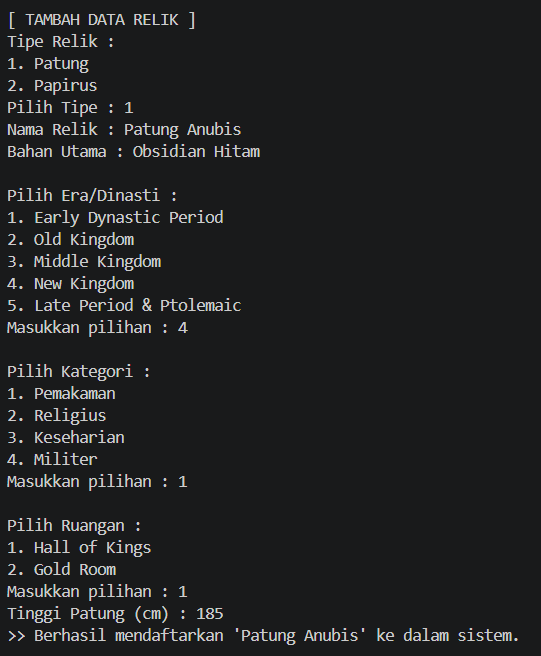
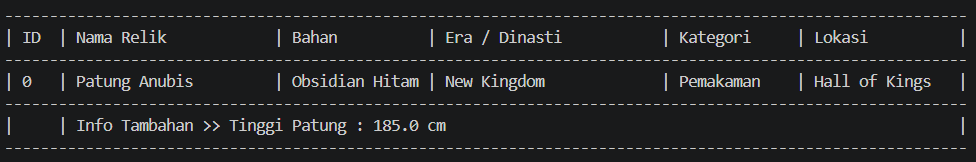
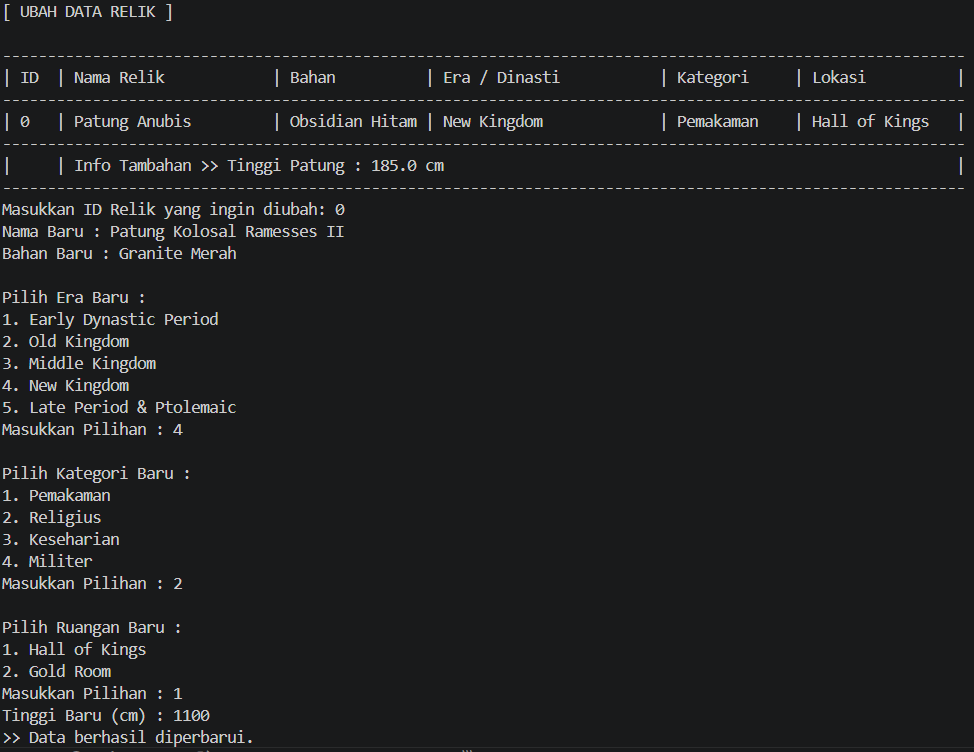
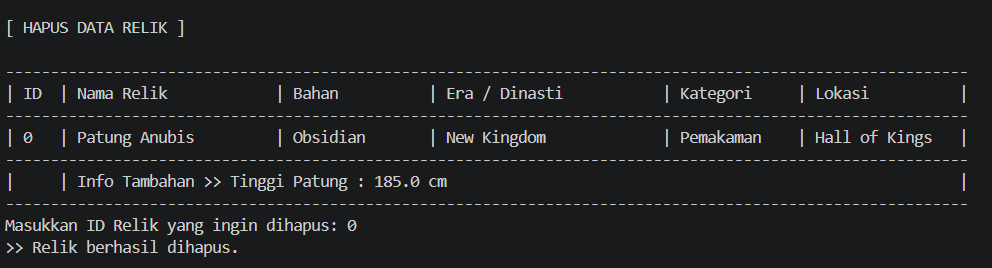
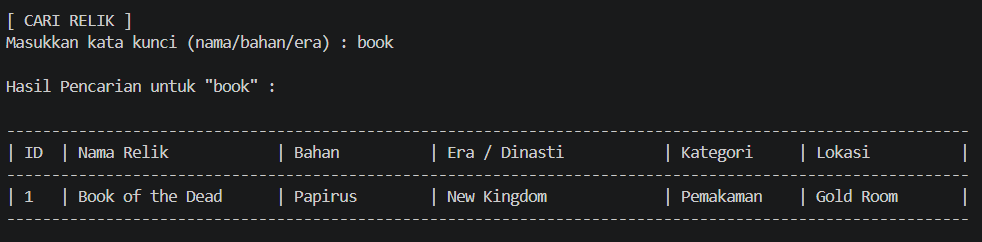

# Museum Inventory Management System
> **Digital Archive for The Egyptian Museum**


---

## Deskripsi Proyek

Program ini dirancang untuk mengelola data artefak sejarah di **The Egyptian Museum**. Sistem memungkinkan kurator museum untuk menambah, melihat, memperbarui, dan menghapus data relik dengan klasifikasi yang terorganisir berdasarkan **Era**, **Kategori**, dan **Ruangan**.

---

## Struktur OOP (Object-Oriented Programming)

Aplikasi ini dibangun dengan arsitektur modular dan hierarki kelas yang jelas:

```
Relik  (Parent Class)
├── Patung  (Subclass)
└── Papirus (Subclass)

Kategori  (Model)
Ruangan   (Model)
```

| Kelas | Tipe | Deskripsi | Atribut Khas |
| :--- | :---: | :--- | :--- |
| `Relik` | Parent | Kelas inti semua artefak | Nama, Bahan, Era, Kategori, Lokasi |
| `Patung` | Subclass | Artefak berbentuk patung | Tinggi (cm), Kategori Ukuran |
| `Papirus` | Subclass | Artefak berbentuk gulungan | Jenis Tulisan, Sistem Tulisan |
| `Kategori` | Model | Pengelompokan jenis artefak | Pemakaman, Religius, Keseharian, Militer |
| `Ruangan` | Model | Lokasi fisik di museum | Nama Ruangan, Lantai |

---

## Konsep Polymorphism

### Override (Method yang Di-override)

| Method | Kelas | Fungsi |
| :--- | :--- | :--- |
| `getInfoDetail()` | `Patung`, `Papirus` | Menampilkan info spesifik tiap jenis relik |
| `tampilkanData(int)` | `Patung`, `Papirus` | Menambah baris ekstra khas masing-masing subclass pada tabel |
| `toString()` | `Patung`, `Papirus` | Format ringkasan string yang berbeda tiap kelas |

**Contoh hasil override `tampilkanData(int)` pada `Patung`:**
```
| Info Tambahan >> Tinggi Patung : 25.0 cm                |
| Kategori Ukuran >> Miniatur (25.0 cm)                   |
```

**Contoh hasil override `tampilkanData(int)` pada `Papirus`:**
```
| Info Tambahan >> Jenis Tulisan : Hieroglif              |
| Sistem Tulisan   >> Tulisan Sakral (Hieroglif)          |
```

---

### Overload (Method yang Di-overload)

#### Di kelas `Relik` — `tampilkanData()`

| Signature | Digunakan Pada | Keterangan |
| :--- | :--- | :--- |
| `tampilkanData(int indeks)` | Menu Lihat Koleksi | Tampilan tabel penuh dengan indeks |
| `tampilkanData()` | Menu Lihat Ringkas | Tampilan vertikal tanpa tabel |
| `tampilkanData(int indeks, boolean tampilDetail)` | Menu Cari Relik | Tampilan tabel dengan/tanpa baris detail |

#### Di kelas `SistemMuseumMesir` — `tambahRelik()`

| Signature | Keterangan |
| :--- | :--- |
| `tambahRelik()` | Input interaktif via Scanner |
| `tambahRelik(..., double tinggiPatung)` | Tambah `Patung` langsung dari parameter |
| `tambahRelik(..., String jenisTulisan)` | Tambah `Papirus` langsung dari parameter |

---

## Fitur Utama (CRUD + Tambahan)

### 1. Create — Tambah Relik
Menambahkan objek relik baru (`Patung` atau `Papirus`) ke dalam sistem secara interaktif maupun programatik.
- Memilih tipe, era/dinasti, kategori, dan ruangan dari daftar yang tersedia
- Mendukung dua overload `tambahRelik()` untuk input otomatis saat inisialisasi

### 2. Read — Lihat Koleksi
Menampilkan seluruh data dalam format tabel yang rapi dengan info tambahan khas masing-masing jenis relik.

### 3. Update — Ubah Data
Memperbarui informasi artefak yang sudah ada berdasarkan indeks ID.
- Mendukung perubahan pada field umum maupun field khusus subclass (`tinggi` / `jenisTulisan`)

### 4. Delete — Hapus Relik
Menghapus data dari memori aplikasi secara permanen menggunakan `ArrayList.remove()`.
- Menampilkan konfirmasi menggunakan `toString()` yang di-override sebelum penghapusan

### 5. Search — Cari Relik *(Fitur Baru)*
Mencari relik berdasarkan kata kunci pada nama, bahan, atau era.
- Menggunakan overload `tampilkanData(int, boolean)` untuk tampilan hasil yang bersih

### 6. Lihat Ringkas *(Fitur Baru)*
Menampilkan koleksi dalam format vertikal yang lebih ringkas.
- Menggunakan overload `tampilkanData()` tanpa parameter

---

## Dokumentasi Output

| Menu Utama | Tambah Data |
|:---:|:---:|
|  |  |

| Lihat Koleksi | Update |
|:---:|:---:|
|  |  |

| Hapus | Cari Relik |
|:---:|:---:|
|  |  |

---

## Cara Menjalankan

Proyek ini dikelola menggunakan **Apache Maven**.

### Prasyarat
- Java JDK 17 atau lebih baru
- Apache Maven 3.6+

### Langkah-langkah

**1. Clone / buka folder proyek**

Pastikan terminal berada di folder utama proyek (root), yaitu folder yang berisi file `pom.xml`.

**2. Compile proyek**
```bash
mvn clean compile
```

**3. Jalankan program**

Untuk **Windows PowerShell / VS Code Terminal**:
```bash
mvn exec:java "-Dexec.mainClass=com.museum.main.SistemMuseumMesir"
```

Untuk **Command Prompt (CMD)**:
```bash
mvn exec:java -Dexec.mainClass="com.museum.main.SistemMuseumMesir"
```

Untuk **Linux / macOS Terminal**:
```bash
mvn exec:java -Dexec.mainClass=com.museum.main.SistemMuseumMesir
```

---

## Struktur Direktori

```
museum-system/
├── pom.xml
├── README.md
├── dokumentasi/
│   ├── mainmenu.png
│   ├── tambah.png
│   ├── lihat.png
│   ├── ubah.png
│   ├── hapus.png
│   └── cari.png
└── src/
    └── main/
        └── java/
            └── com/
                └── museum/
                    ├── main/
                    │   └── SistemMuseumMesir.java
                    └── model/
                        ├── Relik.java
                        ├── Patung.java
                        ├── Papirus.java
                        ├── Kategori.java
                        └── Ruangan.java
```